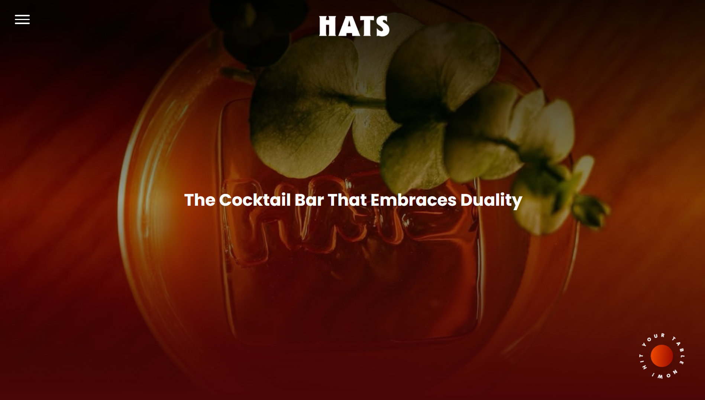

# HATS - The Cocktail Bar


Web application modern untuk HATS, sebuah Cocktail Bar eksklusif. Proyek ini dibangun menggunakan Laravel dan React.js untuk menghadirkan pengalaman Single Page Application yang elegan, responsif, dan seamless.



## Fitur

- **Authentication System**: Login & Register member menggunakan Laravel Breeze.
- **Reservation System**: Formulir reservasi online yang terintegrasi langsung ke database.
- **Dynamic Menu Gallery**: Menu (Cocktails) dan makanan (Foods) yang diambil via API (`/api/menu-items`) dengan fitur horizontal scroll carousel.
- **Stamp Gamification**: User akan mendapatkan reward apabila sudah memenuhi syarat.

## Tech Stack

- **Backend**: Laravel 12.41.1
- **Frontend**: React.js
- **Database**: MySQL

## Instalasi & Run Project

### 1. Clone Repository

```bash
git clone https://github.com/username-anda/hats-bar.git
cd hats-bar
```

### 2. Install Dependencies

Install dependencies backend (PHP) dan frontend (Node.js):

```bash
composer install
npm install
```

### 3. Konfigurasi Environment

Copy file `.env.example` menjadi `.env`:

```bash
cp .env.example .env
```

### 4. Generate Key & Migrasi Database

Generate app key dan run migrasi tabel (pastikan database `hats_db` sudah dibuat di MySQL):

```bash
php artisan key:generate
php artisan migrate
```

**Penting:** Pakai seeder untuk akun admin:

```bash
php artisan db:seed
```
username: admin@hats.bar
password: password

### 5. Jalankan Aplikasi

Jalankan dua solit terminal:

**Terminal 1 (Laravel Server):**
```bash
php artisan serve
```

**Terminal 2 (Vite Development Server):**
```bash
npm run dev
```

Buka browser dan akses: [http://127.0.0.1:8000](http://127.0.0.1:8000)


## Struktur Folder Penting

```
resources/js/Pages/       # Halaman utama (Welcome, Auth, Dashboard)
resources/js/Components/  # Komponen UI reusable
resources/js/Layouts/     # Main layout (GuestLayout, AuthenticatedLayout)
app/Http/Controllers/    # Logic Backend
routes/web.php           # App route
```

---
Project ini adalah sebuah project ujian akhir semester pribadi

© 2025 Faris Hariri - XI RPL SMK Telkom Bandung
